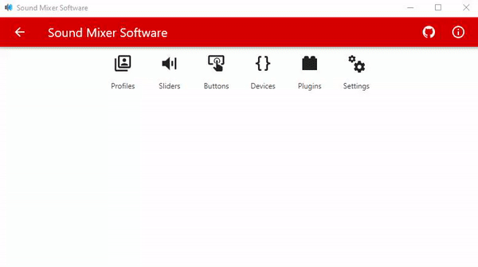

[](https://ci.appveyor.com/project/Krystian20857/soundmixersoftware)
[](http://github.com/Krystian20857/SoundMixerSoftware/releases/)

# Sound Mixer Software
**Sound Mixer Software** is sub-repo of [Sound Mixer](https://github.com/Krystian20857/SoundMixer) project. Purpose of this software is detect connected sound mixer devices and handle incoming data.

<p align="center">
  
</p>

## Features
* Full volume control of application, devices, and default devices.
* Fully customizable volume controllers.
* Volume control of currently focused window with audio session.
* Profile system.
* Multiple buttons functions as: muting, media functions, keystroke, textentry.
* Multiple device support.
* Device offset(shifting controls indexes of specififed device).
* Volume and muting overlays.
* Device connected/disconnected notification.
* Wide application configuration.
* Plugin system for simple extensibility.
* Application theme can be synchronized with system theme.
* Auto-Updater with github releases. Github API 🙏

## Build
### Requirements:
  * .NET Framework 4.7.2
```cmd
dotnet cake build/build.cake  <-- build executables
dotnet cake build/pack.cake   <-- build squirrel installer
```

## Icons
Most of icons included in this project has been downloaded from [icons8.com](https://icons8.com)
