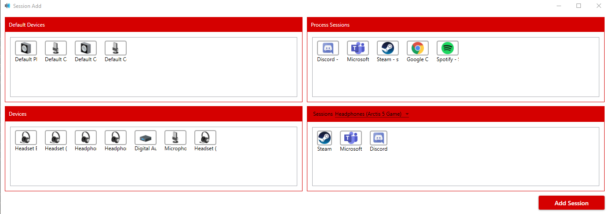

# Sound Mixer Software
Sound Mixer Software is sub-repo of [Sound Mixer](https://github.com/Krystian20857/SoundMixer) project. Purpose of this software is detect connected sound mixer devices and handle incoming data.
Main premise of this piece of code is translate slider move to specified audio session volume. Over time funcionality of this software has increased. Full list of features can be found below.
Currently software has some annoying bug which will be fixed in future. About knows issues and bug later.

## Content
* [Description](#sound-mixer-software)
* [Features](#features)
* [Namespaces](#namespaces)
* [Known Issues](#known-issues)
* [Screenshots](#screenshots)
* [Icons](#Icons)

## Features
* Full volume control of application, devices, and default devices.
* Fully customizable volume sliders.
* Profile system.
* Multiple buttons functions as: muting, media functions, keystroke, textentry.
* Multiple device support.
* Device offset(shifting sliders and buttons indexes of specififed device).
* Volume and muting overlays.
* Device connected/disconnected notification.
* Error notification.
* Wide application configuration.
* Plugin system for simple extensibility.
* Application theme can be synchronized with system theme.

## Namespaces
### SoundMixerSoftware.Win32
  This Project/Assembly contains all interop components as: native methods, native structures, flags. Also Win32 project provides interop wrappers to make interop services easier to use. Most importand wrapper is USBLib which handles device-change and device-properties.
### SoundMixerSoftware.Common
  This Project/Assembly is responsible for higher-level things than Win32 project like: configuration files, profile system, threading and most important simple audio handling system. Also this Namespace contains a lot of utility methods.
### SoundMixerSoftware.Extensibility
  All plugin related things: loading, provides plugin interface, and many more.
### SoundMixerSoftware.Overlay
  Small Project for overlay managment. Contains AbstractOverlay which extends capabilities of ordinary overlay: fading, hiding.
### SoundMixerSoftware.Helpers
  Contains all most logic behind: devices, sliders, buttons, overlays, etc.
### SoundMixerSoftware
  Main Project/Assembly. Contains main bootstrapper and all UI related components.
  
**More detailed information about each project can be found inside corresponding foler.**

## Known Issues
* ~~Adding/removing device will not refresh sessions(Not implemented/issues with implementation)~~ - fixed

## Screenshots

## Icons
Most of icons included in this project has been downloaded from [icons8.com](https://icons8.com)
