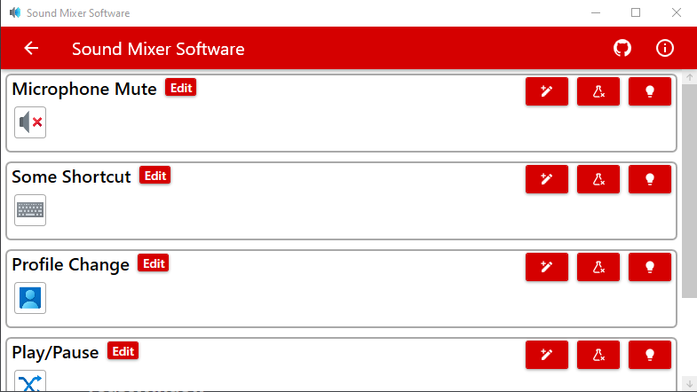

# Sound Mixer Software
Sound Mixer Software is sub-repo of [Sound Mixer](https://github.com/Krystian20857/SoundMixer) project. Purpose of this software is detect connected sound mixer devices and handle incoming data.
Main premise of this piece of code is translate slider move to specified audio session volume. Over time funcionality of this software has increased. Full list of features can be found below.
Currently software has some annoying bug which will be fixed in future. About knows issues and bug later.

## Content
* [Description](#sound-mixer-software)
* [Features](#features)
* [Namespaces](#namespaces)
* [Known Issues](#known-issues)
* [Screenshots](#screenshots)
* [Icons](#Icons)

## Features
* Full volume control of application, devices, and default devices.
* Fully customizable volume sliders.
* Volume control of currently focused window with audio session.
* Profile system.
* Multiple buttons functions as: muting, media functions, keystroke, textentry.
* Multiple device support.
* Device offset(shifting sliders and buttons indexes of specififed device).
* Volume and muting overlays.
* Device connected/disconnected notification.
* Error notification.
* Wide application configuration.
* Plugin system for simple extensibility.
* Application theme can be synchronized with system theme.
* Auto-Updater with github releases. Github API 🙏

## Screenshots

## Icons
Most of icons included in this project has been downloaded from [icons8.com](https://icons8.com)
